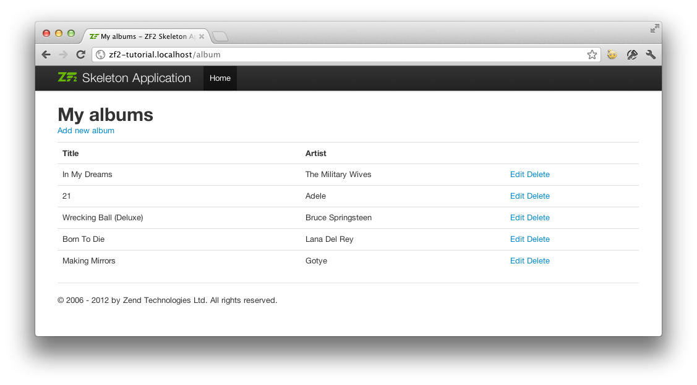

.. _user-guide.database-and-models:

数据库和模型
===================

数据库
------------

现在我们有了 ``Album`` 模块，并且建立了控制器方法和视图脚本，是时候看看我们应用程序的模型部分了。模型是处理完成应用核心目标的部分（所谓的“商业逻辑”），对我们来说，就是操作数据库。我们利用zf2的 ``Zend\Db\TableGateway\TableGateway`` 类在数据库表中查找、添加、更新和删除数据。 

我们将通过PHP的PDO驱动来使用Mysql。创建一个数据库 ``zf2tutorial`` ，运行下面的SQL语句来创建album表，并给它添加一些数据。

.. code-block:: sql
   :linenos:

    CREATE TABLE album (
      id int(11) NOT NULL auto_increment,
      artist varchar(100) NOT NULL,
      title varchar(100) NOT NULL,
      PRIMARY KEY (id)
    );
    INSERT INTO album (artist, title)
        VALUES  ('The  Military  Wives',  'In  My  Dreams');
    INSERT INTO album (artist, title)
        VALUES  ('Adele',  '21');
    INSERT INTO album (artist, title)
        VALUES  ('Bruce  Springsteen',  'Wrecking Ball (Deluxe)');
    INSERT INTO album (artist, title)
        VALUES  ('Lana  Del  Rey',  'Born  To  Die');
    INSERT INTO album (artist, title)
        VALUES  ('Gotye',  'Making  Mirrors');

（选择的这些测试数据恰好是在英国亚马逊的畅销书写作的时间！）

现在数据库中有一些数据，我们可以给它写一个简单的模型。

模型文件
---------------

Zend Framework没有提供一个 ``Zend\Model`` 组件，因为模型是你的商业逻辑，这些该由你来决定他们是怎么运行的。有许多组件可以使用，它们取决于你的需要。一种方法是用类表示应用程序中的每个实体模型，然后使用映射程序加载和保存实体对象到数据库。另一种是使用对象映射技术（ORM），例如Doctrine 或 Propel。

本教程中，我们打算创建一个简单的模型类，创建一个 ``AlbumTable`` 类来使用 ``Zend\Db\TableGateway\TableGateway`` 类，在 ``Zend\Db\TableGateway\TableGateway`` 类中，每一个唱片对象是一个 ``Album`` 对象 （成为*实体*）。这是表数据网关设计模式的实现，与数据表中数据实现对接。注意表数据网关模式会成为大型系统中的限制。很容易犯的一个错误是，将数据库连接代码放在控制器方法中，因为这些都被 ``Zend\Db\TableGateway\AbstractTableGateway`` 公开了。 *不要这样做！* 

让我们开始在 ``module/Album/src/Album/Model`` 创建一个叫做 ``Album.php`` 的文件：

.. code-block:: php
   :linenos:

    namespace Album\Model;

    class Album
    {
        public $id;
        public $artist;
        public $title;

        public function exchangeArray($data)
        {
            $this->id     = (!empty($data['id'])) ? $data['id'] : null;
            $this->artist = (!empty($data['artist'])) ? $data['artist'] : null;
            $this->title  = (!empty($data['title'])) ? $data['title'] : null;
        }
    }

我们的 ``Album`` 实体对象只是一个简单的PHP类。为了和 ``Zend\Db`` 的 ``TableGateway`` 类一起运行，我们需要实例化 ``exchangeArray()`` 方法。这个方法仅仅把传递过来的数据复制到对象的属性。使用表单的时候，我们稍后会添加一个输入过滤机制。

下一步，我们在 ``module/Album/src/Album/Model`` 目录创建 ``AlbumTable.php`` 文件：

.. code-block:: php
   :linenos:

    namespace Album\Model;

    use Zend\Db\TableGateway\TableGateway;

    class AlbumTable
    {
        protected $tableGateway;

        public function __construct(TableGateway $tableGateway)
        {
            $this->tableGateway = $tableGateway;
        }

        public function fetchAll()
        {
            $resultSet = $this->tableGateway->select();
            return $resultSet;
        }

        public function getAlbum($id)
        {
            $id  = (int) $id;
            $rowset = $this->tableGateway->select(array('id' => $id));
            $row = $rowset->current();
            if (!$row) {
                throw new \Exception("Could not find row $id");
            }
            return $row;
        }

        public function saveAlbum(Album $album)
        {
            $data = array(
                'artist' => $album->artist,
                'title'  => $album->title,
            );

            $id = (int) $album->id;
            if ($id == 0) {
                $this->tableGateway->insert($data);
            } else {
                if ($this->getAlbum($id)) {
                    $this->tableGateway->update($data, array('id' => $id));
                } else {
                    throw new \Exception('Album id does not exist');
                }
            }
        }

        public function deleteAlbum($id)
        {
            $this->tableGateway->delete(array('id' => (int) $id));
        }
    }

这里稍微麻烦一些。首先，我们给 ``TableGateway`` 类的构造函数设置protected属性 ``$tableGateway`` 。我们使用它对我们的模型数据库表进行操作。

然后，我们创建一些应用将会使用到的辅助函数。 ``fetchAll()`` 从数据库中取出所有的唱片信息放在一个 ``结果集`` 中， ``getAlbum()`` 取出一条 ``唱片`` 对象数据， ``saveAlbum()`` 或者在数据库中添加一条信息，或者修改一条已经存在的信息， ``deleteAlbum()`` 把某条数据完全删除。每一个方法的代码是有效且容易理解的。

使用服务管理来配置表入口并注入到album表
----------------------------------------------------------------------------------

为了使用相同的 ``AlbumTable`` 实例，我们会用 ``服务管理`` 来说明怎么创建一个。This is most easily done in the
Module class where we create a method called ``getServiceConfig()`` which is
automatically called by the ``ModuleManager`` and applied to the ``ServiceManager``.
We’ll then be able to retrieve it in our controller when we need it.

To configure the ``ServiceManager``, we can either supply the name of the class
to be instantiated or a factory (closure or callback) that instantiates the
object when the ``ServiceManager`` needs it. We start by implementing
``getServiceConfig()`` to provide a factory that creates an ``AlbumTable``. Add
this method to the bottom of the ``Module.php`` file in ``module/Album``.

.. code-block:: php
   :linenos:
   :emphasize-lines: 5-8,14-32

    namespace Album;

    // Add these import statements:
    use Album\Model\Album;
    use Album\Model\AlbumTable;
    use Zend\Db\ResultSet\ResultSet;
    use Zend\Db\TableGateway\TableGateway;

    class Module
    {
        // getAutoloaderConfig() and getConfig() methods here

        // Add this method:
        public function getServiceConfig()
        {
            return array(
                'factories' => array(
                    'Album\Model\AlbumTable' =>  function($sm) {
                        $tableGateway = $sm->get('AlbumTableGateway');
                        $table = new AlbumTable($tableGateway);
                        return $table;
                    },
                    'AlbumTableGateway' => function ($sm) {
                        $dbAdapter = $sm->get('Zend\Db\Adapter\Adapter');
                        $resultSetPrototype = new ResultSet();
                        $resultSetPrototype->setArrayObjectPrototype(new Album());
                        return new TableGateway('album', $dbAdapter, null, $resultSetPrototype);
                    },
                ),
            );
        }
    }

This method returns an array of ``factories`` that are all merged together by
the ``ModuleManager`` before passing them to the ``ServiceManager``. The factory
for ``Album\Model\AlbumTable`` uses the ``ServiceManager`` to create an
``AlbumTableGateway`` to pass to the ``AlbumTable``. We also tell the
``ServiceManager`` that an ``AlbumTableGateway`` is created by getting a
``Zend\Db\Adapter\Adapter`` (also from the ``ServiceManager``) and using it
to create a ``TableGateway`` object. The ``TableGateway`` is told to use an
``Album`` object whenever it creates a new result row. The TableGateway
classes use the prototype pattern for creation of result sets and entities.
This means that instead of instantiating when required, the system clones a
previously instantiated object. See
`PHP Constructor Best Practices and the Prototype Pattern <http://ralphschindler.com/2012/03/09/php-constructor-best-practices-and-the-prototype-pattern>`_
for more details.

Finally, we need to configure the ``ServiceManager`` so that it knows how to get a
``Zend\Db\Adapter\Adapter``. This is done using a factory called
``Zend\Db\Adapter\AdapterServiceFactory`` which we can configure within the
merged config system. Zend Framework 2’s ``ModuleManager`` merges all the
configuration from each module’s ``module.config.php`` file and then merges in
the files in ``config/autoload`` (``*.global.php`` and then ``*.local.php``
files). We’ll add our database configuration information to ``global.php`` which
you should commit to your version control system. You can use ``local.php``
(outside of the VCS) to store the credentials for your database if you want to.
Modify ``config/autoload/global.php`` (in the Zend Skeleton root, not inside the 
Album module) with following code:

.. code-block:: php
   :linenos:

    return array(
        'db' => array(
            'driver'         => 'Pdo',
            'dsn'            => 'mysql:dbname=zf2tutorial;host=localhost',
            'driver_options' => array(
                PDO::MYSQL_ATTR_INIT_COMMAND => 'SET NAMES \'UTF8\''
            ),
        ),
        'service_manager' => array(
            'factories' => array(
                'Zend\Db\Adapter\Adapter'
                        => 'Zend\Db\Adapter\AdapterServiceFactory',
            ),
        ),
    );

You should put your database credentials in ``config/autoload/local.php`` so
that they are not in the git repository (as ``local.php`` is ignored):

.. code-block:: php
   :linenos:

    return array(
        'db' => array(
            'username' => 'YOUR USERNAME HERE',
            'password' => 'YOUR PASSWORD HERE',
        ),
    );

回到控制器
----------------------

Now that the ``ServiceManager`` can create an ``AlbumTable`` instance for us, we
can add a method to the controller to retrieve it. Add ``getAlbumTable()`` to
the ``AlbumController`` class:

.. code-block:: php
   :linenos:

    // module/Album/src/Album/Controller/AlbumController.php:
        public function getAlbumTable()
        {
            if (!$this->albumTable) {
                $sm = $this->getServiceLocator();
                $this->albumTable = $sm->get('Album\Model\AlbumTable');
            }
            return $this->albumTable;
        }

You should also add:

.. code-block:: php
   :linenos:

    protected $albumTable;

to the top of the class.

We can now call ``getAlbumTable()`` from within our controller whenever we need
to interact with our model.

If the service locator was configured correctly in ``Module.php``, then we
should get an instance of ``Album\Model\AlbumTable`` when calling ``getAlbumTable()``.

Listing albums
--------------

In order to list the albums, we need to retrieve them from the model and pass
them to the view. To do this, we fill in ``indexAction()`` within
``AlbumController``.  Update the ``AlbumController``’s ``indexAction()`` like
this:

.. code-block:: php
   :linenos:

    // module/Album/src/Album/Controller/AlbumController.php:
    // ...
        public function indexAction()
        {
            return new ViewModel(array(
                'albums' => $this->getAlbumTable()->fetchAll(),
            ));
        }
    // ...

With Zend Framework 2, in order to set variables in the view, we return a
``ViewModel`` instance where the first parameter of the constructor is an array
from the action containing data we need. These are then automatically passed to
the view script. The ``ViewModel`` object also allows us to change the view
script that is used, but the default is to use ``{controller name}/{action
name}``. We can now fill in the ``index.phtml`` view script:

.. code-block:: php
   :linenos:

    <?php
    // module/Album/view/album/album/index.phtml:

    $title = 'My albums';
    $this->headTitle($title);
    ?>
    <h1><?php echo $this->escapeHtml($title); ?></h1>
    

        <a href="<?php echo $this->url('album', array('action'=>'add'));?>">Add new album</a>
    

    <table class="table">
    <tr>
        <th>Title</th>
        <th>Artist</th>
        <th>&nbsp;</th>
    </tr>
    <?php foreach ($albums as $album) : ?>
    <tr>
        <td><?php echo $this->escapeHtml($album->title);?></td>
        <td><?php echo $this->escapeHtml($album->artist);?></td>
        <td>
            <a href="<?php echo $this->url('album',
                array('action'=>'edit', 'id' => $album->id));?>">Edit</a>
            <a href="<?php echo $this->url('album',
                array('action'=>'delete', 'id' => $album->id));?>">Delete</a>
        </td>
    </tr>
    <?php endforeach; ?>
    </table>

The first thing we do is to set the title for the page (used in the layout) and
also set the title for the ``<head>`` section using the ``headTitle()`` view
helper which will display in the browser’s title bar. We then create a link to
add a new album.

The ``url()`` view helper is provided by Zend Framework 2 and is used to create
the links we need. The first parameter to ``url()`` is the route name we wish to use
for construction of the URL, and the second parameter is an array of all the
variables to fit into the placeholders to use. In this case we use our ‘album’
route which is set up to accept two placeholder variables: ``action`` and ``id``.

We iterate over the ``$albums`` that we assigned from the controller action. The
Zend Framework 2 view system automatically ensures that these variables are
extracted into the scope of the view script, so that we don’t have to worry
about prefixing them with ``$this->`` as we used to have to do with Zend
Framework 1; however you can do so if you wish.

We then create a table to display each album’s title and artist, and provide
links to allow for editing and deleting the record. A standard ``foreach:`` loop
is used to iterate over the list of albums, and we use the alternate form using
a colon and ``endforeach;`` as it is easier to scan than to try and match up
braces. Again, the ``url()`` view helper is used to create the edit and delete
links.

.. note::

    We always use the ``escapeHtml()`` view helper to help protect
    ourselves from Cross Site Scripting (XSS) vulnerabilities (see http://en.wikipedia.org/wiki/Cross-site_scripting).

If you open ``http://zf2-tutorial.localhost/album`` you should see this:

