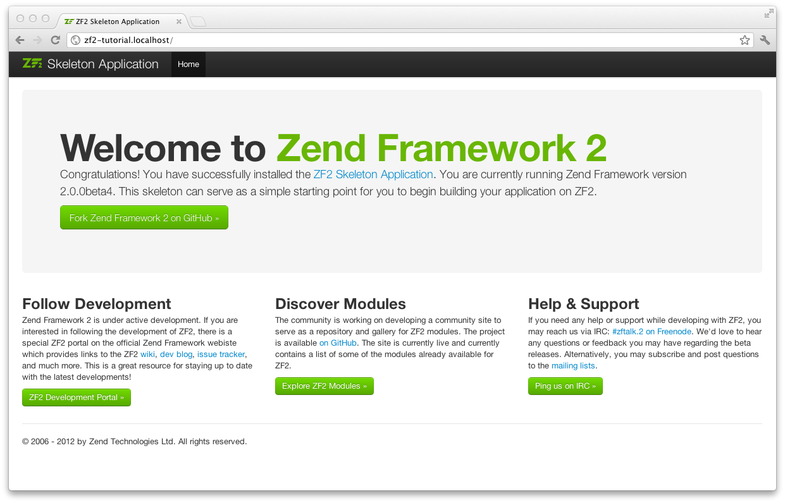

.. _user-guide.skeleton-application:

开始：骨架应用
=======================================

为创建我们的应用，我们以 `ZendSkeletonApplication <https://github.com/zendframework/ZendSkeletonApplication>`_ （可以通过 `github <https://github.com/>`_ 获得）开始。
使用composer(http://getcomposer.org)来创建一个新zend framework应用。

.. code-block:: bash
   :linenos:

    php composer.phar create-project --stability="dev" repository-url="https://packages.zendframework.com" zendframework/skeleton-application path/to/install
    php composer.phar update

.. 注意::

    另一个安装ZendSkeletonApplication的方法是使用github。去https://github.com/zendframework/ZendSkeletonApplication 单击“ZIP”按钮就会下载一个``ZendSkeletonApplication-master.zip``相似的文件。

    把此文件解压到虚拟主机目录并重命名为``zf2-tutorial``。

    ZendSkeletonApplication使用Composer (http://getcomposer.org)来解决它的依赖性，在这里，依赖指的是zf2自己。

    To install Zend Framework 2 into our application we simply type:
    安装zf2到我们的应用，我们只用输入：

    .. code-block:: bash
       :linenos:

        php composer.phar self-update
        php composer.phar install
        php composer.phar update

    从``zf2-tutorial`` 目录。等一会，我们会看到类似下面的输出：

    .. code-block:: bash
       :linenos:

        Installing dependencies from lock file
        - Installing zendframework/zendframework (dev-master)
          Cloning 18c8e223f070deb07c17543ed938b54542aa0ed8

        Generating autoload files

.. 注意::

    如果看到这样的信息： 

    .. code-block:: bash
       :linenos:

        [RuntimeException]      
          The process timed out. 

    说明你的网速太慢而不能及时下载完整的包，导致composer超时。为避免这个错误，用下面的命令代替：

    .. code-block:: bash
       :linenos:

        php composer.phar install
        php composer.phar update

    运行：

    .. code-block:: bash
       :linenos:

        COMPOSER_PROCESS_TIMEOUT=5000 php composer.phar install
        COMPOSER_PROCESS_TIMEOUT=5000 php composer.phar update
        
.. 注意::

   使用windows系统wamp的用户：
   
   1. 安装windows的composer
      通过以下命令检查是否正确安装 
      
      .. code-block:: bash
         :linenos:
         
         composer
         
   2. 安装windows版本git，也需要把git路径添加到windows环境变量
      通过以下命令检查git是否正确安装
      
      .. code-block:: bash
         :linenos:
         
         git
         
   3. 现在用命令行安装zf2
      
      .. code-block:: bash
         :linenos:
         
         composer create-project --repository-url="https://packages.zendframework.com" -s dev zendframework/skeleton-application path/to/install
   

现在我们来设置web服务器设置。

使用Apache Web Server
---------------------------

你的创建一个Apache虚拟主机，以便可以通过 ``http://zf2-tutorial.localhost`` 访问``zf2-tutorial/public``目录的index.php页面。

设置虚拟主机通常需要设置 ``httpd.conf`` 或
``extra/httpd-vhosts.conf``。如果使用 ``httpd-vhosts.conf`` 要确保该文件已经被 ``httpd.conf`` 包含进来。
一些Linux发行版本（如Ubuntu）包含Apache，它们的配置文件存储在 ``/etc/apache2``，并且为``/etc/apache2/sites-enabled``目录内的每一个虚拟主机创建一个文件。在这种情况下，你要把虚拟主机部分放在文件``/etc/apache2/sites-enabled/zf2-tutorial``中。

确保 ``NameVirtualHost`` 已经设置并设置为“\*:80”，然后在下面的代码中配置一个虚拟主机：

.. code-block:: apache
   :linenos:

    <VirtualHost *:80>
        ServerName zf2-tutorial.localhost
        DocumentRoot /path/to/zf2-tutorial/public
        SetEnv APPLICATION_ENV "development"
        <Directory /path/to/zf2-tutorial/public>
            DirectoryIndex index.php
            AllowOverride All
            Order allow,deny
            Allow from all
        </Directory>
    </VirtualHost>

确保 ``/etc/hosts`` 和
``c:\windows\system32\drivers\etc\hosts`` 文件已做了修改，以使 ``zf2-tutorial.localhost``
指向 ``127.0.0.1``。 这样网站就可以通过``http://zf2-tutorial.localhost``访问了。

.. code-block:: none
   :linenos:

    127.0.0.1               zf2-tutorial.localhost localhost

重启Apache。

如果你已经正确地做了以上这些，你应该能够看到如下内容：

测试 ``.htaccess`` 文件是否设置正确，打开 ``http://zf2-tutorial.localhost/1234`` 页面，你应该看到如下界面：

.. image:: ../images/user-guide.skeleton-application.404.png
    :width: 940 px

如果你看到了一个标准的Apache 404页面，你就得在继续下一步之前重新检查 ``.htaccess`` 的使用。
如果你使用的是开启了URL Rewrite模块的IIS服务器，导入如下代码：

.. code-block:: apache
   :linenos:

    RewriteCond %{REQUEST_FILENAME} !-f
    RewriteRule ^ index.php [NC,L]

现在你有了一个可以运行的骨架应用，我们开始给它添加细节。

使用内置的PHP CLI服务
---------------------------------

另外 —— 如果你使用版本5.4以上的PHP —— 你可以使用内置的CLI服务（cli-server）。你只用在根目录开启服务就可以使用它了：

.. code-block:: bash
    :linenos:
    
    php -S 0.0.0.0:8080 -t public/ public/index.php

这样，通过所有网络接口的8080端口就可以访问此网站了，用 ``public/index.php`` 来控制路由。
这意味着通过 http://localhost:8080 或者 http://<your-local-IP>:8080 来访问网站。

如果你做的都正确，你应该能够看到和上面的Apache一样的结果。

为了测试你的路由是正确的，访问http://localhost:8080/1234 ，你会看到和上面的Apache一样的错误页面。

.. 注意::

    内置CLI 服务 **只限于开发**。

错误报告
---------------

另外， *使用Apache时*， 你可以用 ``VirtualHost`` 中的 ``APPLICATION_ENV`` 设置来让PHP把所有的错误输出到浏览器。在开发过程中，这是很有用的。

编辑 ``zf2-tutorial/public/`` 目录的 ``index.php`` ：

.. code-block:: php
   :linenos:

    <?php

    /**
     * Display all errors when APPLICATION_ENV is development.
     */
    if ($_SERVER['APPLICATION_ENV'] == 'development') {
        error_reporting(E_ALL);
        ini_set("display_errors", 1);
    }
    
    /**
     * This makes our life easier when dealing with paths. Everything is relative
     * to the application root now.
     */
    chdir(dirname(__DIR__));
    
    // Decline static file requests back to the PHP built-in webserver
    if (php_sapi_name() === 'cli-server' && is_file(__DIR__ . parse_url($_SERVER['REQUEST_URI'], PHP_URL_PATH))) {
        return false;
    }

    // Setup autoloading
    require 'init_autoloader.php';
    
    // Run the application!
    Zend\Mvc\Application::init(require 'config/application.config.php')->run();
