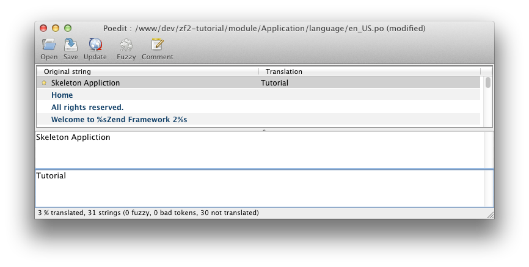

.. _user-guide.styling-and-translations:

样式和翻译
========================

我们已经看到了骨架应用的样式，挺漂亮的，但是我们需要改变它的标题并移除版权信息。骨架应用使用 ``Zend\I18n`` 的翻译功能来翻译所有文本。它使用``module/Application/language`` 中的 ``.po`` 文件，你需要 `poedit
<http://www.poedit.net/download.php>`_ 来改变文本。用poedit打开 ``module/Application/language/en_US.po``，点击 ``Original`` 字符串清单里的“Skeleton Application”，输入“Tutorial”作为翻译。

点击工具栏上的保存按钮，它会创建一个 ``en_US.mo`` 文件。如果你发现没有 ``.mo`` 文件生成，检查 ``Preferences -> Editor -> Behavior`` 的  ``Automatically compile .mo file on save`` 复选框是否选中。

要移除版权信息，我们得编辑 ``应用`` 模块的 ``layout.phtml`` 视图脚本：

.. code-block:: php
   :linenos:

    // module/Application/view/layout/layout.phtml:
    // Remove this line:
    
&copy; 2005 - 2014 by Zend Technologies Ltd. <?php echo $this->translate('All 
    rights reserved.') ?>

现在这个页面看起来比之前稍微好了一点！

.. image:: ../images/user-guide.styling-and-translations.translated-image.png
    :width: 940 px
